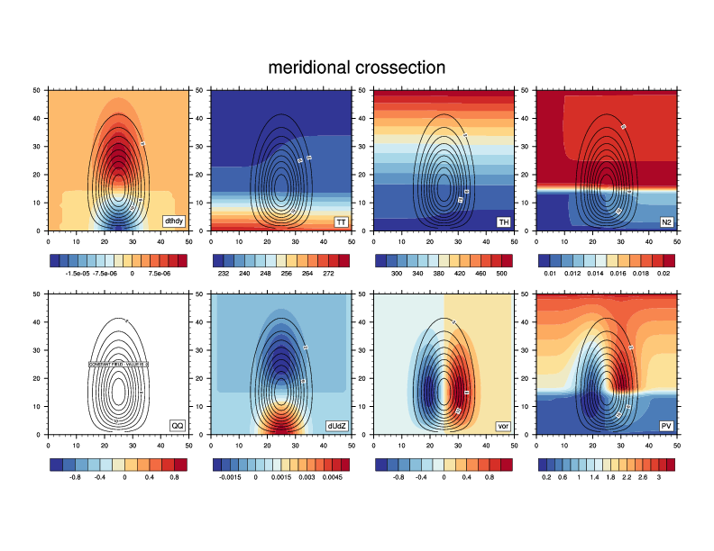
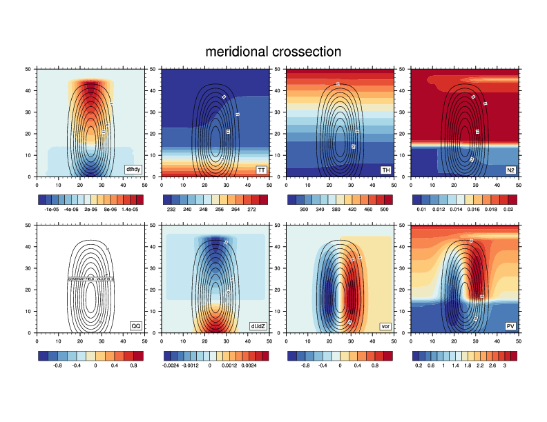

====
Jets
====

The windfield is calculated in fort/jet.f90, subroutine calc_jet(uu,y,z).
Input arguments are y and z in (m). Where (y,z)=(0,0) is located at the lower, northern corner. 
If the jetwidth is smaller than the domainwidth, then (y,z)=(0,0) is the starting location of the jet (not the domain).
New jet profiles can be added to this subroutine, mind the only restriction on the initial windfield:
the windspeed has to vanish at the vertical boundaries (i.e. uu(0,z)=0 and uu(ny,z)=0)

Implemented jets are outlined below (all variables are tuned in the namelist.initJET file).

.. |Umax| replace:: U\ :sub:`max`
.. |Uwidth| replace:: U\ :sub:`width`
.. |Uhgt| replace:: U\ :sub:`hgt`
.. |Ubottom| replace:: U\ :sub:`bottom`
.. |Utop| replace:: U\ :sub:`top`
.. |Sst| replace:: S\ :sub:`st`
.. |Str| replace:: S\ :sub:`tr`

U_type=1
---------
Kind of a Polvani-and-Esler-immitation

.. math::
	uu(y,z) = U_{max}\left[\sin^3\left(\pi\sin^2\left(\frac{\pi}{2}\frac{y}{U_{width}}\right)\right)\right]\left[\frac{z}{U_{hgt}}\exp{\left(-0.5\left(\frac{z}{U_{hgt}}\right)^2-1\right)}\right]

   Example with: |Umax| =20 ms-1, |Uwidth| =900 km, and |Uhgt| =6 km

U_type=2
--------- 
Sinsoidal shape, separate definition above and below the jet-maximum. 
Vertical boundaries of jet set by |Ubottom| and |Utop|, surface winds possible by setting |Ubottom| <0.
Height of the shear is controlled via S\ :sub:`xx`.

Vertical extend of the jet:

.. math::
	z_{jet} = \left\{
 	\begin{array}{lll}
	 U_{top}+|U_{bottom}| & \text{if } U_{bottom}\leq 0\\
	U_{top}-U_{bottom}   & \text{if } U_{bottom}>0
	\end{array}\right.

Vertical extend in troposphere/statosphere:

.. math::
	hh_{tr}=U_{hgt}-U_{bottom}\\
	hh_{st}=U_{bottom}+z_{jet}-U_{hgt}

Windspeed:

.. math::
	uu(y,z) = \left\{
	\begin{array}{ll}
	U_{max}\left[\sin^3\left(\pi\sin^2\left(\frac{\pi}{2}\frac{y}{U_{width}}\right)\right)\right]\left[\sin^{S_{st}}\left(\frac{\pi}{2}\frac{U_{bottom}+z_{jet}-z}{hh_{st}}\right)\right]&\text{if }U_{max}<z<U_{top} \\
	U_{max}\left[\sin^3\left(\pi\sin^2\left(\frac{\pi}{2}\frac{y}{U_{width}}\right)\right)\right]\left[\sin^{S_{tr}}\left(\frac{\pi}{2}\frac{z-U_{bottom}}{hh_{tr}}\right)\right] &\text{if } 0 \leq z \leq U_{max}
	\end{array}\right.

													

   Example with: |Umax| =20 ms-1, |Uwidth| =900 km, |Uhgt| =6 km, |Ubottom| = -2 km, |Utop| = 16 km, |Sst| = 1, |Str| = 1,

U_type=6
--------- 
Simple (single segment) "reverse shear" jet. Sinusoidal decrease of windspeed with height, maximum windspeed at the surface.

Horizontal windfield shape:

.. math:: 
	U_h(y)=U_{max}\left[\sin^3\left(\pi\sin^2\left(\frac{\pi}{2}\frac{y}{U_{width}}\right)\right)\right]

Total windfield:

.. math::
	\begin{array}{ll}
	\displaystyle{U(y,z)=U_h\cos^{ss}\left(\frac{\pi}{2}\frac{z}{H}\right)} & \text{if   } z < H\\
	\end{array}
	

The shape of the vertical shear is controlled by ss, and the windspeed decreases to 0.0 at height H.

U_type=7
--------- 
Low level jet with maximum windspeed close to the ground (specified level) and decreasing exponential to the sides. From the specified level the windspeed drops logarithmical to the lowest vertical level.

Horizontal windfield shape:

.. math::
	U_h(y) = U_{max}\exp{\left(-0.5\left(\frac{\|y-\frac{U_{width}}{2}\|}{y_{llj}}\right)^{nh_{llj}}\right)}

Total windfield
.. math::
	uu(y,z) = U_h(y) \left\{
	\begin{array}{ll}
	\exp{-0.5\left(\frac{z-brd_{llj}}{h_{llj}}\right)^{ny_{llj}}} & \text{if} z \geq brd_{llj} \\

	\left(\exp{pr_{llj}\left(\frac{z}{h2_{llj}}\right)}-scl\right) & \text{if} brd_{llj} > z \geq 0

	\end{array}\right.

Where brd_llj is the height for maximum wind speed and scl a scale factor for the windspeed at the ground. 
Problem for this jet can be, that the stabilty gets negativ due to much curvature of the jet.
Working configuration:

..math::
	U_width=0.9d6, U_max=20.d0,\\
	h_{llj}=2.5d3, y_{llj}=3.5d5, nh_{llj}=4.d0, ny_{llj}=1.4d0,\\
	brd_{llj}=1.2d3,  pr_{llj}=1.0d0, h2_{llj}=2.5d3, scl = 1.0

U_type=8
--------- 
Sinsoidal shape, separate definition above and below the jet-maximum. 
Vertical boundaries of jet set by |Ubottom| and |Utop|, surface winds possible by setting |Ubottom| <0.
Height of the shear is controlled via S\ :sub:`xx`.
Set hor\ :sub:`leng` if you want to have a plateau in the horizontal wind profile. 

Vertical extend of the jet:

.. math::
	z_{jet} = U_{top}-U_{bottom}

Vertical extend in above and below the jet maximum:

.. math::
	hh_{tr}=U_{hgt}-U_{bottom}\\
	hh_{st}=U_{bottom}+z_{jet}-brd_{llj}

Windspeed:

horizontal:
.. math::
	U_{horz}=\left/{
	\begin{array}{ll}
	\sin^{S_{h}}\left(\pi\left(\sin^{2}\left(\frac{\pi}{2}\frac{y}{U_{width}-hor_{leng}}\right)\right)\right) & \text{if } y \leq U_max \\
	1 & \text{if } U_{max} < y < U_{max}+hor_{leng} \\
	\sin^{S_{h}}\left(\pi\left(\sin^{2}\left(\frac{\pi}{2}\frac{y-hor_{leng}}{U_{width}-hor_{leng}}\right)\right)\right) & \text{if } U_{max}+hor_{leng} \le y  \\
	\end{array}\right.

vertical:
.. math::
	U_{vert} = \left\{
	\begin{array}{ll}
	\sin^{S_{o}}\left(\frac{\pi}{2}\frac{U_{top}-z}{hh_{o}}\right)&\text{if }brd_{llj}<z<U_{top}\\
	\sin^{S_{u}}\left(\frac{\pi}{2}\frac{z-U_{bottom}}{hh_{u}}\right)&\text{if } 0 \leq z \leq brd_{llj}
	\end{array}\right.
	

total:
.. math::
	uu(y,z) = U_{max} U_{horz} U_{vert}												

	
